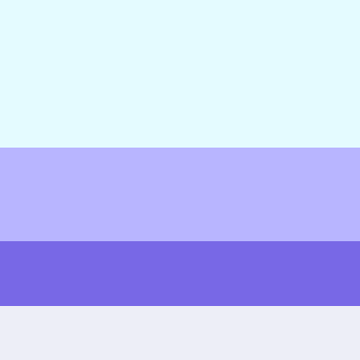

# color palette
>rgb(228, 251, 255)
>rgb(184, 181, 255)
>rgb(120, 104, 230)
>rgb(237, 238, 247)

# to do list
[] make dashboard 
[] make signup page
[] make login page
[] handle backend for dashboard
[] handle backend for signup 
[] backend for login
[] forum
[] backend forum
